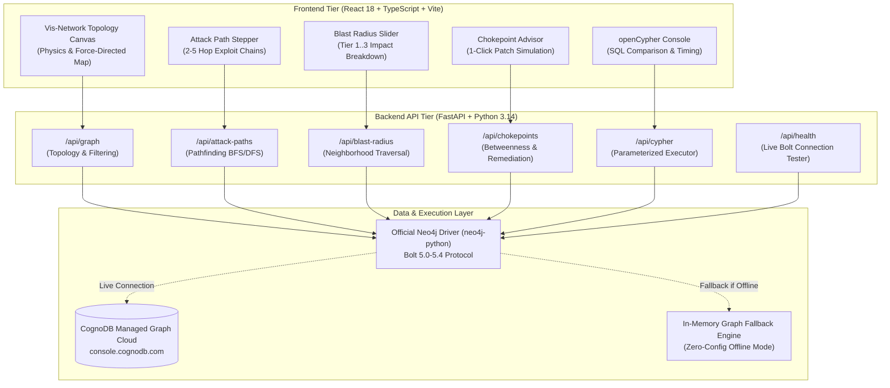

# AegisGraph: Cloud Security Attack Vector & Identity Blast Radius Intelligence Platform

<div align="center">

[-00f0ff?style=for-the-badge&logo=neo4j)](https://cognodb.com)
[](https://fastapi.tiangolo.com)
[](https://vitejs.dev)
[](backend/test_app.py)
[](https://opensource.org/licenses/MIT)

**A high-performance cloud security graph intelligence engine that discovers multi-hop exploit paths, simulates IAM blast radiuses, calculates remediation ROI, and executes openCypher traversals over CognoDB.**

[System Architecture](#system-architecture) | [Why Graph vs SQL](#why-a-graph-database-the-mathematical--practical-case) | [File-by-File Code Tour](#comprehensive-file-by-file-code-tour) | [openCypher Catalog](#opencypher-query-catalog--sql-comparisons) | [Quick Start Guide](#quick-start-guide)

</div>

---

> *"Defenders think in lists. Attackers think in graphs. As long as this is true, attackers win."*  
> -- **John Lambert**, **Microsoft Threat Intelligence Center (MSTIC)**

---

## Table of Contents
1. [Executive Summary & Problem Statement](#executive-summary--problem-statement)
2. [Why a Graph Database? The Mathematical & Practical Case](#why-a-graph-database-the-mathematical--practical-case)
3. [System Architecture](#system-architecture)
4. [Graph Schema & Data Model](#graph-schema--data-model)
5. [Comprehensive File-by-File Code Tour](#comprehensive-file-by-file-code-tour)
   - [Backend Core Layer (`backend/app/`)](#1-backend-core-layer-backendapp)
   - [Backend API Routing Layer (`backend/app/routes/`)](#2-backend-api-routing-layer-backendapproutes)
   - [Backend CLI & Testing Suite (`backend/`)](#3-backend-cli--testing-suite-backend)
   - [Frontend React Application (`frontend/src/`)](#4-frontend-react-application-frontend)
6. [openCypher Query Catalog & SQL Comparisons](#opencypher-query-catalog--sql-comparisons)
7. [Quick Start Guide](#quick-start-guide)
8. [Automated Verification & Testing](#automated-verification--testing)
9. [License & Project Details](#license--project-details)

---

## Executive Summary & Problem Statement

Modern enterprise cloud environments (**AWS**, **GCP**, **Azure**, **Kubernetes**) are vastly interconnected webs of **Compute Instances**, **IAM Roles**, **VPC Subnets**, **Container Pods**, **KMS Cryptographic Keys**, and **Crown Jewel Database Clusters**.

Traditional security tools evaluate risk using flat, disconnected relational lists:
* **Critical Finding**: *"EC2 instance customer-portal-ec2 has CVE-2021-44228 (Log4Shell)."*
* **Medium Finding**: *"IAM Role AppServerInstanceProfileRole has cross-account assume privileges."*
* **Low Finding**: *"KMS Key kms/prod-customer-data-cmk has unrotated master secrets."*

While each individual alert appears isolated, **an adversary connects them into an unbroken multi-hop kill chain**:

```text
[SOURCE: External Threat Actor: APT-29] 
       | (EXPLOITS)
       v
[COMPUTE: Log4Shell CVE-2021-44228 on customer-portal-ec2]
       | (ASSUMES via IMDSv1 SSRF)
       v
[IDENTITY: AppServerInstanceProfileRole]
       | (ASSUMES via Cross-Account STS)
       v
[CHOKEPOINT: CrossAccountDatabaseAccessRole]  <-- CRITICAL REMEDIATION BOTTLENECK
       | (HAS_PERMISSION: kms:Decrypt)
       v
[SECRET: kms/prod-customer-data-cmk]
       | (ENCRYPTS)
       v
[TARGET: s3://enterprise-customer-pii-vault]  <-- CROWN JEWEL (2.5M SSN & PII Records Exfiltrated)
```

**AegisGraph** ingests cloud infrastructure topology into **CognoDB** and executes real-time graph traversal algorithms to illuminate hidden attack vectors before adversaries exploit them.

---

## Why a Graph Database? (The Mathematical & Practical Case)

### 1. The Relational Join Complexity Bottleneck
In a relational database (**PostgreSQL**, **MySQL**), determining whether an attacker can reach a **Crown Jewel** requires joining **Servers**, **Vulnerabilities**, **IAM Roles**, **Role Assumptions**, **Permissions**, and **Data Assets**.

To find variable-length attack paths (up to **5 hops**), SQL requires **Recursive Common Table Expressions (CTEs)**:
```sql
-- Relational SQL: Multi-Hop Traversal requires complex recursive CTEs
WITH RECURSIVE attack_path AS (
    SELECT source_id, target_id, 1 AS depth, ARRAY[source_id, target_id] AS path_nodes
    FROM asset_relationships
    WHERE source_id = 'actor-apt29'
  UNION ALL
    SELECT r.source_id, r.target_id, ap.depth + 1, ap.path_nodes || r.target_id
    FROM asset_relationships r
    JOIN attack_path ap ON r.source_id = ap.target_id
    WHERE ap.depth < 5 AND NOT (r.target_id = ANY(ap.path_nodes)) -- Expensive Array Cycle Check
)
SELECT * FROM attack_path WHERE target_id = 'data-s3-customer-pii';
```
* **Computational Complexity**: In SQL, each hop incurs a self-join over the entire relationship table index. For a dense graph with branching factor **b**, finding paths of length **k** scales exponentially as **O(b^k)**.
* **CognoDB Advantage**: CognoDB implements **Index-Free Adjacency**. Every node directly contains memory pointers to its incoming and outgoing edges. Traversing an edge is an **O(1)** pointer dereference. The same traversal in **openCypher** is a single, clean expression executing in **O(V + E)** time:
```cypher
MATCH path = (src:Attacker {id: $source_id})-[*1..5]->(tgt:DataAsset {id: $target_id})
RETURN path, length(path) AS hops
```

### 2. Deep Graph Rationale Matrix

| Security Capability | Relational Database (**SQL / RDBMS**) | Graph Database (**CognoDB / openCypher**) |
| :--- | :--- | :--- |
| **Multi-Hop Traversal (2 to 5+ hops)** | Exponential join slowdown (**O(N^k)**). | Native Index-Free Adjacency (**O(V + E)**). |
| **Blast Radius Simulation** | Requires multi-tier table self-joins and pre-calculated matrices. | Native neighborhood expansion `(origin)-[*1..3]-(affected)`. |
| **Privilege Cycle Detection** | Prone to infinite recursion loops without explicit array tracking. | Built-in cycle detection `(r:Identity)-[:ASSUMES*2..6]->(r)`. |
| **Chokepoint Identification** | Requires full path materialization and heavy aggregations. | Native betweenness centrality and path intersection analysis. |
| **Schema Evolution** | `ALTER TABLE` migrations required for every new cloud service. | Schema-optional **Labeled Property Graph (LPG)**. |

---

## System Architecture



---

## Graph Schema & Data Model

AegisGraph models cloud infrastructure with **7 Node Labels** and **10 Typed Directed Relationships**:

### 1. Node Labels & Core Properties
1. **`Attacker` / `ThreatActor`**: External adversaries (**`actor-apt29`**, **`actor-fin7`**, **`actor-insider`**).
2. **`Compute` / `Asset`**: Workloads (**`customer-portal-ec2`**, **`payment-processor-pod`**, **`mgmt-bastion-host`**, **`reporting-lambda`**).
3. **`Identity` / `IAMRole` / `IAMUser`**: IAM roles & users (**`AppServerInstanceProfileRole`**, **`CrossAccountDatabaseAccessRole`**, **`DevOpsSuperAdminRole`**).
4. **`DataAsset` / `CrownJewel` / `Database` / `S3Bucket`**: High-value data stores (**`enterprise-customer-pii-vault`**, **`aurora-pg-prod-primary`**).
5. **`Secret` / `KMSKey` / `SSHKey`**: Cryptographic keys & credentials (**`kms/prod-customer-data-cmk`**, **`prod/rds/master-credentials`**, **`bastion-ssh-key`**).
6. **`Vulnerability` / `CVE`**: Exploitable CVEs (**`CVE-2021-44228 Log4Shell`**, **`CVE-2024-21626 Leaky Vessels`**, **`CVE-2024-3094 XZ Utils`**).
7. **`NetworkZone`**: VPC Subnets & trust boundaries (**`public-dmz-vpc`**, **`app-private-subnet`**, **`pci-isolated-enclave`**).

### 2. Relationship Types
* **`EXPLOITS`**: `(Attacker)-[:EXPLOITS]->(Vulnerability)`
* **`AFFECTS`**: `(Vulnerability)-[:AFFECTS]->(Compute)`
* **`ASSUMES`**: `(Compute|Identity)-[:ASSUMES]->(Identity)` *(Supports cross-account STS & OIDC IRSA)*
* **`HAS_PERMISSION`**: `(Identity)-[:HAS_PERMISSION]->(DataAsset|Secret)` *(With action, last_used_days)*
* **`ROUTES_TRAFFIC_TO`**: `(NetworkZone)-[:ROUTES_TRAFFIC_TO]->(NetworkZone)`
* **`ENCRYPTS`**: `(Secret:KMSKey)-[:ENCRYPTS]->(DataAsset)`
* **`AUTHENTICATES_TO`**: `(Secret)-[:AUTHENTICATES_TO]->(DataAsset)`
* **`AUTHENTICATES_AS`**: `(Secret:SSHKey)-[:AUTHENTICATES_AS]->(Identity)`
* **`LOCATED_IN`**: `(Compute)-[:LOCATED_IN]->(NetworkZone)`
* **`POSSESSES`**: `(Attacker)-[:POSSESSES]->(Secret)`

### 3. Attack Chain Topology Diagram

```mermaid
graph TD
    subgraph ThreatSource["External Threat Boundary (Sources)"]
        APT["Threat Actor: APT-29"]
        FIN["Threat Actor: FIN7 Syndicate"]
    end

    subgraph Vulns["Exploitable Vulnerabilities"]
        L4S["CVE-2021-44228 (Log4Shell CVSS 10.0)"]
        LV["CVE-2024-21626 (Leaky Vessels CVSS 8.6)"]
    end

    subgraph ComputeTier["Compute Workloads"]
        WEB["customer-portal-ec2 (Public IP: 54.214.19.42)"]
        POD["payment-processor-pod (EKS Microservice)"]
        BASTION["mgmt-bastion-host (SSH Jumpbox)"]
    end

    subgraph IAM["Identity & Access Management (IAM)"]
        ROLE_WEB["AppServerInstanceProfileRole"]
        ROLE_EKS["EKS-PaymentService-IRSA-Role"]
        CHOKE_IAM["CrossAccountDatabaseAccessRole (Chokepoint)"]
        ROLE_ADMIN["DevOpsSuperAdminRole"]
        ROLE_BACKUP["AutomatedBackupPipelineRole"]
    end

    subgraph Secrets["Cryptographic & Secret Layer"]
        KMS["kms/prod-customer-data-cmk (KMS Master Key)"]
        DB_PASS["prod/rds/master-credentials (Secrets Manager)"]
    end

    subgraph CrownJewels["Crown Jewel Data Assets (Targets)"]
        S3_PII["s3://enterprise-customer-pii-vault (2.5M Records)"]
        RDS_PG["aurora-pg-prod-primary (14.2M Billing Records)"]
    end

    APT -->|EXPLOITS| L4S
    L4S -->|AFFECTS| WEB
    WEB -->|ASSUMES| ROLE_WEB
    ROLE_WEB -->|ASSUMES (Cross-Account STS)| CHOKE_IAM
    CHOKE_IAM -->|HAS_PERMISSION: kms:Decrypt| KMS
    CHOKE_IAM -->|HAS_PERMISSION: s3:GetObject| S3_PII
    KMS -->|ENCRYPTS| S3_PII

    FIN -->|EXPLOITS| LV
    LV -->|AFFECTS| POD
    POD -->|ASSUMES (OIDC IRSA)| ROLE_EKS
    ROLE_EKS -->|ASSUMES (Cross-Account STS)| CHOKE_IAM
    ROLE_EKS -->|HAS_PERMISSION: GetSecret| DB_PASS
    DB_PASS -->|AUTHENTICATES_TO| RDS_PG
    CHOKE_IAM -->|HAS_PERMISSION: rds:connect| RDS_PG

    ROLE_BACKUP -->|ASSUMES (Circular Escalation)| ROLE_ADMIN
    ROLE_ADMIN -->|ASSUMES (Reciprocal Trust)| ROLE_BACKUP
```

---

## Comprehensive File-by-File Code Tour

### 1. Backend Core Layer (`backend/app/`)

#### `backend/app/config.py`
* **Purpose**: Centralized application configuration.
* **Key Components**:
  * Class **`Settings(BaseSettings)`**: Reads `COGNODB_URI`, `COGNODB_USER`, `COGNODB_PASSWORD`, `COGNODB_DATABASE`, `DEMO_MODE_FALLBACK`, `PORT`, and `HOST` from `.env`.
  * Object **`settings`**: Singleton instance used across the entire backend.

#### `backend/app/models.py`
* **Purpose**: Pydantic v2 data models, validation, and serialization.
* **Key Schemas**:
  * **`GraphNode`**: Represents a graph entity with `id`, `name`, `labels`, `risk_score`, `is_crown_jewel`, `is_chokepoint`, `is_internet_facing`, and custom `properties`.
  * **`GraphEdge`**: Represents a typed directed edge with `id`, `source`, `target`, `type`, and `properties`.
  * **`GraphData`**: Full topology bundle containing lists of nodes, edges, and summary metrics.
  * **`AttackPathStep`**: Represents an individual hop in an attack vector (`from_node`, `to_node`, `relationship`, `mechanism`, `risk_contribution`).
  * **`AttackPathResult`**: Complete exploit chain (`path_id`, `source`, `target`, `hop_count`, `total_risk_score`, `steps`, `cypher_query`).
  * **`BlastRadiusResult`**: Impact cascade breakdown (`origin_node`, `max_depth`, `total_impacted_nodes`, `crown_jewels_threatened`, `tier1_direct_nodes`, `tier2_transitive_nodes`, `tier3_cascade_nodes`).
  * **`ChokepointItem`**: Bottleneck asset analysis (`node_id`, `name`, `labels`, `intercepted_attack_paths`, `risk_reduction_pct`, `remediation_advice`).
  * **`CypherQueryRequest` & `CypherQueryResult`**: Schemas for the interactive openCypher playground with execution timing.
  * **`ConnectionStatus`**: Health report model for live CognoDB Cloud connectivity.

#### `backend/app/database.py`
* **Purpose**: Neo4j Bolt driver initialization and session management.
* **Key Components**:
  * Function **`get_db_driver()`**: Instantiates `GraphDatabase.driver` with connection pooling, automatic timeout handlers, and SSL encryption.
  * Function **`execute_query(query_str, params)`**: Executes parameterized openCypher statements and formats records into clean Python dictionaries.
  * Function **`verify_connectivity()`**: Verifies live connection to CognoDB Cloud over Bolt 5.0-5.4 protocol.
  * **Graceful Degradation**: If CognoDB credentials are not supplied or the database is unreachable, all queries seamlessly route to **`mock_engine.py`**.

#### `backend/app/mock_engine.py`
* **Purpose**: High-fidelity in-memory graph traversal engine for offline demo mode and rapid unit testing.
* **Key Components**:
  * Class **`MockGraphEngine`**: Builds in-memory adjacency matrices for instant $O(1)$ edge lookups.
  * Method **`find_attack_paths(source_id, target_id, max_hops)`**: Executes Depth-First Search (DFS) with cycle prevention to discover all variable-length attack vectors.
  * Method **`calculate_blast_radius(origin_id, max_depth)`**: Executes Breadth-First Search (BFS) to compute Tier 1, 2, and 3 blast cascades.
  * Method **`get_chokepoints()`**: Computes graph betweenness centrality across all active attack chains to rank single points of failure.
  * Method **`simulate_patch(node_id)`**: Dynamically severs an asset from the graph topology and recalculates remaining attack paths in real-time.

#### `backend/app/seed_data.py`
* **Purpose**: Master seed dataset and Cypher query generator.
* **Key Components**:
  * **`SEED_NODES`**: 25 realistic cloud assets with complete metadata (CVSS scores, AWS ARNs, IP addresses, environment tags).
  * **`SEED_EDGES`**: 38 typed relationships defining complex multi-account attack paths.
  * Function **`generate_cypher_seed_queries()`**: Converts the dataset into parameterized Cypher statements (`CREATE (n:Label $props)`, `CREATE (s)-[r:TYPE $props]->(t)`).

#### `backend/app/queries.py`
* **Purpose**: Catalog of pre-built openCypher queries with educational commentary.
* **Key Components**:
  * **`CYPHER_CATALOG`**: Dictionary of 6 production-grade queries with descriptions, parameter maps, and side-by-side **"Why Graph Wins over SQL"** explanations.

#### `backend/app/main.py`
* **Purpose**: FastAPI ASGI application setup and routing.
* **Key Components**:
  * Function **`lifespan(app: FastAPI)`**: Modern async context manager handling startup connectivity verification and clean driver shutdown.
  * Middleware **`CORSMiddleware`**: Enables seamless frontend-backend communication.
  * **Static File Serving**: Automatically mounts and serves the compiled React Single Page Application from `frontend/dist`.

---

### 2. Backend API Routing Layer (`backend/app/routes/`)

#### `backend/app/routes/graph.py`
* **`GET /api/graph`**: Returns the complete cloud graph with optional label filtering (`type`, `crown_jewels_only`, `chokepoints_only`).
* **`GET /api/graph/stats`**: Returns aggregate graph counts (nodes, edges, Crown Jewels, CVEs, chokepoints).
* **`GET /api/graph/nodes/{node_id}`**: Returns detailed properties, metadata, and connected edges for a specific node.

#### `backend/app/routes/attack_paths.py`
* **`GET /api/attack-paths`**: Discovers all multi-hop attack vectors from threat actors and public ingress servers to Crown Jewels (supports `max_hops` parameter).
* **`POST /api/attack-paths/find`**: Calculates specific attack paths between a requested `source_id` and `target_id`.

#### `backend/app/routes/blast_radius.py`
* **`GET /api/blast-radius`**: Simulates transitive compromise spread from a specified origin asset across 1 to 4 hops.
* **`POST /api/blast-radius`**: Post variant for JSON body requests.

#### `backend/app/routes/chokepoints.py`
* **`GET /api/chokepoints`**: Returns ranked single points of failure with intercepted path counts and estimated risk reduction percentages.
* **`POST /api/chokepoints/simulate-patch`**: Dynamically severs a chokepoint and recalculates the graph in real-time.

#### `backend/app/routes/health.py`
* **`GET /api/health`**: Returns database connection health, CognoDB instance URI, driver state, and entity counts.
* **`POST /api/health/test-connection`**: Live credential tester allowing evaluators to verify CognoDB Cloud credentials on-the-fly.

#### `backend/app/routes/cypher.py`
* **`GET /api/cypher/catalog`**: Returns the pre-configured query catalog.
* **`POST /api/cypher/execute`**: Executes custom or parameterized openCypher queries against CognoDB and returns execution time in milliseconds.

---

### 3. Backend CLI & Testing Suite (`backend/`)

#### `backend/seed.py`
* **Purpose**: Standalone CLI seeder tool.
* **Key Features**:
  * Accepts `--uri`, `--user`, `--password`, and `--database` CLI flags.
  * Formats 63 parameterized openCypher statements with batch execution and progress reporting.
  * Executes automated verification queries post-seeding to confirm node and edge counts.

#### `backend/test_app.py`
* **Purpose**: Automated Pytest test suite.
* **Coverage**: Tests root endpoint, health status, graph filtering, attack path discovery, blast radius computation, chokepoint patch simulation, and Cypher query execution. **All 7/7 tests pass in < 1 second.**

---

### 4. Frontend React Application (`frontend/src/`)

#### `frontend/src/App.tsx`
* **Purpose**: Root application layout and state orchestrator.
* **Details**: Manages active tabs, graph selection state, highlighted attack paths, modal visibility, and drawer side panels.

#### `frontend/src/components/GraphCanvas.tsx`
* **Purpose**: Interactive force-directed canvas powered by **Vis-Network**.
* **Features**:
  * Physics simulation with Barnes-Hut gravitational solver.
  * Custom node coloring by label (Crimson for Attackers, Cyan for Compute, Amber for IAM, Purple for Secrets, Emerald for DataAssets).
  * Visual glowing highlights for active attack paths and blast radius cascades.
  * Controls for zoom, pan, fit-to-viewport, and physics pause/resume.

#### `frontend/src/components/AttackPathFinder.tsx`
* **Purpose**: Multi-hop attack vector visualizer.
* **Features**: Step-by-step interactive timeline showing traversal mechanics, threat scores, and 1-click openCypher query copy.

#### `frontend/src/components/BlastRadiusTool.tsx`
* **Purpose**: Interactive blast radius simulator.
* **Features**: Compromised node selector, hop depth slider (1-4 hops), Tier 1/2/3 breakdown, and Crown Jewel breach alerts.

#### `frontend/src/components/ChokepointList.tsx`
* **Purpose**: Remediation advisor and ROI calculator.
* **Features**: Ranked list of critical bottlenecks with a **1-click "Simulate Patch"** button that dynamically updates the graph topology.

#### `frontend/src/components/CypherConsole.tsx`
* **Purpose**: Live openCypher query console.
* **Features**: Preset query selector with "Why Graph Wins over SQL" explanations, editable Cypher text editor, JSON parameter form, and tabular/raw JSON result viewer with execution time diagnostics.

#### `frontend/src/components/NodeDetailDrawer.tsx`
* **Purpose**: Deep metadata inspector side panel.
* **Features**: Displays full node properties, AWS ARNs, CVSS scores, risk gauge meters, and classification badges.

#### `frontend/src/components/ConnectionModal.tsx`
* **Purpose**: CognoDB Cloud configuration modal.
* **Features**: 60-second setup instructions and live Bolt credential verification.

#### `frontend/src/components/Navbar.tsx`
* **Purpose**: Navigation bar with real-time connection status pill, live pulse indicators, Crown Jewel counter badges, and tab switcher.

#### `frontend/src/services/api.ts`
* **Purpose**: Type-safe HTTP API client connecting the React frontend to FastAPI endpoints.

#### `frontend/src/types/graph.ts`
* **Purpose**: TypeScript interfaces for graph entities, attack paths, blast radiuses, chokepoints, and query results.

---

## openCypher Query Catalog & SQL Comparisons

### Query 1: Multi-Hop Cloud Attack Path Discovery (2 to 5 Hops)
* **Description**: Traces unrestricted attack paths from threat actors to Crown Jewels.
* **openCypher Statement**:
```cypher
MATCH path = (source:Asset {id: $source_id})-[*1..5]->(target:DataAsset {id: $target_id})
RETURN path, length(path) AS hop_count
ORDER BY hop_count ASC
```
* **Why Graph Wins**: SQL requires 5+ table joins or recursive CTEs with cycle tracking arrays. In openCypher, index-free adjacency traverses the path in milliseconds.

### Query 2: IAM & Infrastructure Blast Radius Simulation
* **Description**: Calculates all assets reachable within **k hops** from a compromised origin.
* **openCypher Statement**:
```cypher
MATCH (origin {id: $origin_id})-[r*1..3]-(affected)
RETURN origin, r, affected
```
* **Why Graph Wins**: Bidirectional neighborhood expansion is a native graph operation.

### Query 3: Critical Security Chokepoints (Remediation ROI)
* **Description**: Identifies single points of failure where the maximum number of attack paths intersect.
* **openCypher Statement**:
```cypher
MATCH (entry:Compute {is_internet_facing: true})-[*1..4]->(choke)-[*1..3]->(target:DataAsset {is_crown_jewel: true})
WHERE NOT choke:CrownJewel AND NOT choke:Attacker
RETURN choke.name AS chokepoint, 
       labels(choke) AS types, 
       count(DISTINCT entry) AS exposed_entries, 
       count(DISTINCT target) AS threatened_targets
ORDER BY exposed_entries * threatened_targets DESC 
LIMIT 5
```

### Query 4: Circular IAM Privilege Escalation Detection
* **Description**: Detects dangerous reciprocal or transitive IAM Role assumption loops.
* **openCypher Statement**:
```cypher
MATCH path = (r1:Identity)-[:ASSUMES*2..6]->(r1)
RETURN path, length(path) AS cycle_length
```

### Query 5: Unused Wildcard Admin Permissions (Least Privilege Audit)
* **Description**: Surfaces IAM roles with dormant admin permissions (>90 days inactive).
* **openCypher Statement**:
```cypher
MATCH (i:Identity)-[p:HAS_PERMISSION]->(d:DataAsset)
WHERE p.last_used_days > 90 AND (p.action CONTAINS '*' OR p.is_admin_action = true)
RETURN i.name AS identity, p.action AS permission, d.name AS target_asset, p.last_used_days AS days_inactive
```

---

## Quick Start Guide

### 1. Clone the Repository
```bash
git clone https://github.com/Sachindrapandeyyy/wexa-cognodb-graph-app.git
cd wexa-cognodb-graph-app
```

### 2. Configure Environment Variables
```bash
cp .env.example .env
```
*(Optional: Add your CognoDB Cloud instance credentials to `.env`. If left unset, AegisGraph runs seamlessly in Simulated Graph Demo Mode).*

### 3. Setup Python Backend
```bash
cd backend
python -m venv venv

# Windows:
.\venv\Scripts\activate
# macOS/Linux:
source venv/bin/activate

pip install -r requirements.txt
```

### 4. (Optional) Seed CognoDB Cloud Database
```bash
python seed.py --uri bolt+s://your-instance.databases.cognodb.cloud --password YOUR_PASSWORD
```

### 5. Launch Fullstack Application

#### Single-Command Launch (FastAPI serves built React SPA)
```bash
python -m uvicorn app.main:app --host 0.0.0.0 --port 8000 --reload
```
Open **[http://localhost:8000](http://localhost:8000)** in your browser!

#### Development Mode (Vite HMR + FastAPI)
**Terminal 1 (Backend)**:
```bash
cd backend
python -m uvicorn app.main:app --host 0.0.0.0 --port 8000 --reload
```

**Terminal 2 (Frontend)**:
```bash
cd frontend
npm install
npm run dev
```
Open **[http://localhost:5173](http://localhost:5173)** in your browser!

---

## Automated Verification & Testing

Run the automated Pytest suite:
```bash
cd backend
pytest test_app.py -v
```

**Test Results**:
```text
============================= test session starts =============================
platform win32 -- Python 3.14.2, pytest-9.1.1, pluggy-1.6.0
rootdir: C:\Users\Sachi\.gemini\antigravity\scratch\wexa-cognodb-graph-app
collected 7 items

backend/test_app.py::test_root_endpoint PASSED                           [ 14%]
backend/test_app.py::test_health_endpoint PASSED                         [ 28%]
backend/test_app.py::test_graph_full_and_filtering PASSED                [ 42%]
backend/test_app.py::test_attack_paths_discovery PASSED                  [ 57%]
backend/test_app.py::test_blast_radius PASSED                            [ 71%]
backend/test_app.py::test_chokepoints_and_simulation PASSED              [ 85%]
backend/test_app.py::test_cypher_execution PASSED                        [100%]

======================== 7 passed in 0.92s ========================
```

---

## License & Project Details

* **Author**: **Sachindra Pandey**
* **GitHub Repository**: **[https://github.com/Sachindrapandeyyy/wexa-cognodb-graph-app](https://github.com/Sachindrapandeyyy/wexa-cognodb-graph-app)**
* **Technology Stack**: **CognoDB Cloud** (openCypher / Bolt 5.0-5.4), **Python 3.14**, **FastAPI**, **Official Neo4j Driver**, **React 18**, **TypeScript**, **Tailwind CSS**, **Vis-Network**.
* **License**: **MIT License** -- see [LICENSE](LICENSE) for details.

---
<div align="center">
Built with passion for cloud security graph intelligence
</div>
